# 🚀 AWS ENI Networking Lab with Elastic IP & Apache Web Server


---

# 📌 Project Overview

This project demonstrates the implementation of **AWS Elastic Network Interfaces (ENI)** with **Elastic IPs**, **Apache HTTP Server**, and **Linux Networking Administration** inside AWS EC2 infrastructure.

The project focuses on:
- Primary & Secondary ENI configuration
- Elastic IP association
- Apache Web Server deployment
- Linux networking validation
- ENI lifecycle behavior
- AWS networking fundamentals
- GitHub project documentation

This lab helped build practical understanding of AWS cloud networking and infrastructure administration.

---

# 🎯 Project Objective

The objective of this project is to design and validate AWS networking using Elastic Network Interfaces.

### Key Objectives

- Understand AWS ENI concepts
- Configure multiple ENIs
- Associate Elastic IPs
- Deploy Apache HTTP Server
- Validate Linux networking
- Understand ENI termination behavior
- Practice Linux administration
- Build professional GitHub documentation

---

# 🏗️ Architecture Overview

```text
AWS Cloud (us-east-2)
│
├── VPC
│
├── EC2 Instance (linux-server)
│   │
│   ├── Primary ENI
│   │    ├── Private IP: 172.31.42.54
│   │    ├── Secondary Private IP: 172.31.42.55
│   │    └── Elastic IP: 3.23.201.105
│   │
│   └── Secondary ENI
│        ├── Private IP: 172.31.40.61
│        └── Elastic IP: 16.58.218.132
│
├── Security Groups
│    ├── SSH (22)
│    └── HTTP (80)
│
└── Apache HTTP Server
      └── NIC-LAB Web Page
```

---

# 🌍 AWS Region

```text
us-east-2 (Ohio)
```

---

# 🛠️ AWS Services Used

| Service | Purpose |
|----------|----------|
| Amazon EC2 | Virtual Linux Server |
| Elastic Network Interface (ENI) | Multiple network interfaces |
| Elastic IP | Static public IP |
| Security Groups | Traffic filtering |
| Apache HTTP Server | Web hosting |
| Red Hat Linux | Operating system |

---

# ✅ Prerequisites

- AWS Account
- EC2 Key Pair
- Basic Linux Knowledge
- AWS Networking Basics
- Git & GitHub

---

# 📂 Repository Structure

```text
aws-eni-lab/
│
├── README.md
│
├── screenshots/
│   ├── 01-ec2-instance-running.png
│   ├── 02-security-groups.png
│   ├── 03-primary-eni-details.png
│   ├── 04-primary-elastic-ip.png
│   ├── 05-secondary-eni-details.png
│   ├── 06-secondary-elastic-ip.png
│   ├── 07-secondary-eni-termination-behavior.png
│   ├── 08-primary-eni-termination-behavior.png
│   ├── 09-ssh-connection.png
│   ├── 10-linux-ip-address-verification.png
│   ├── 11-apache-installation.png
│   ├── 12-apache-service-validation.png
│   ├── 13-browser-output-primary-ip.png
│   ├── 14-browser-output-elastic-ip-primary.png
│   └── 15-browser-output-elastic-ip-secondary.png
│
├── commands/
│   ├── apache-commands.md
│   ├── eni-commands.md
│   └── linux-networking.md
│
├── notes/
│   ├── eni-concepts.md
│   ├── troubleshooting.md
│   └── networking-basics.md
│
└── docs/
    └── project-flow.md
```

---

# ⚙️ Project Implementation Steps

## Step 1 — Launch EC2 Instance

Created a Red Hat Linux EC2 instance in AWS.

### Screenshot

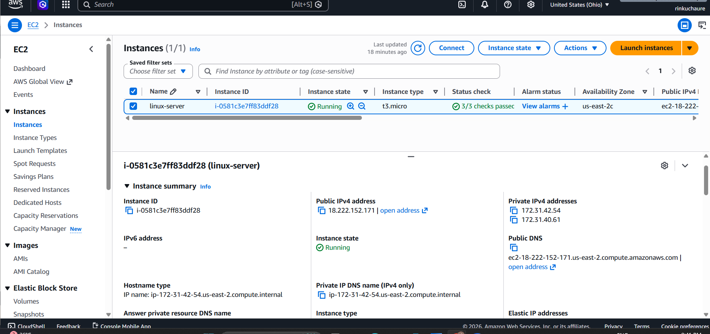

---

## Step 2 — Configure Security Groups

Allowed:
- SSH (22)
- HTTP (80)

### Screenshot

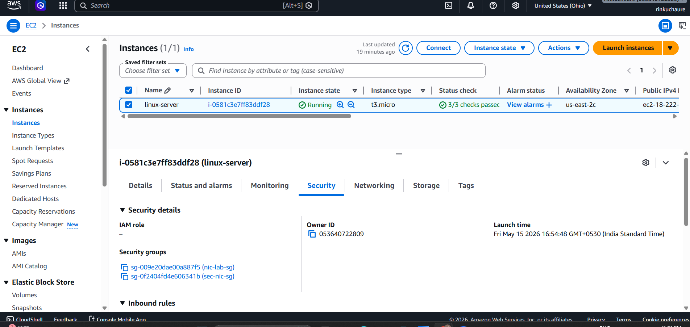

---

## Step 3 — Configure Primary ENI

Validated:
- Primary private IP
- Secondary private IP
- Public IP association

### Screenshot

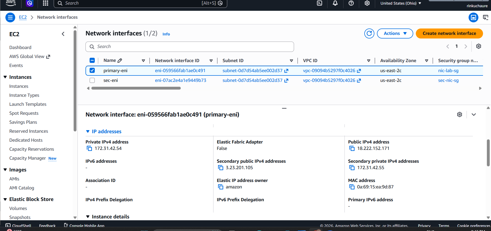

---

## Step 4 — Associate Elastic IP to Primary ENI

### Screenshot

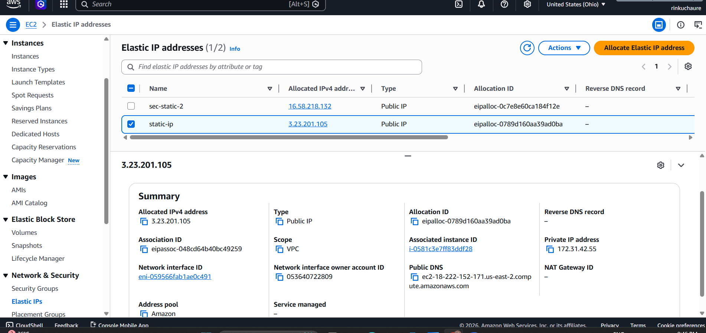

---

## Step 5 — Configure Secondary ENI

Attached additional ENI to EC2 instance.

### Screenshot

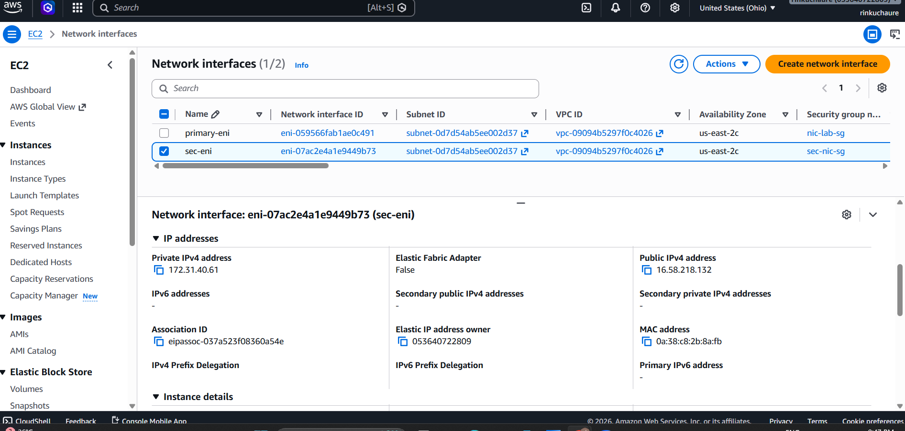

---

## Step 6 — Associate Elastic IP to Secondary ENI

### Screenshot

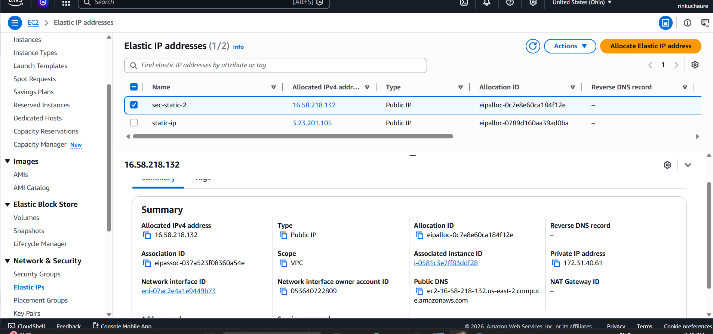

---

## Step 7 — Verify ENI Termination Behavior

### Primary ENI


### Secondary ENI


---

# 🐧 Linux Networking Validation

## SSH Connection

```bash
ssh -i "fdkey.pem" ec2-user@3.23.201.105
```

### Screenshot

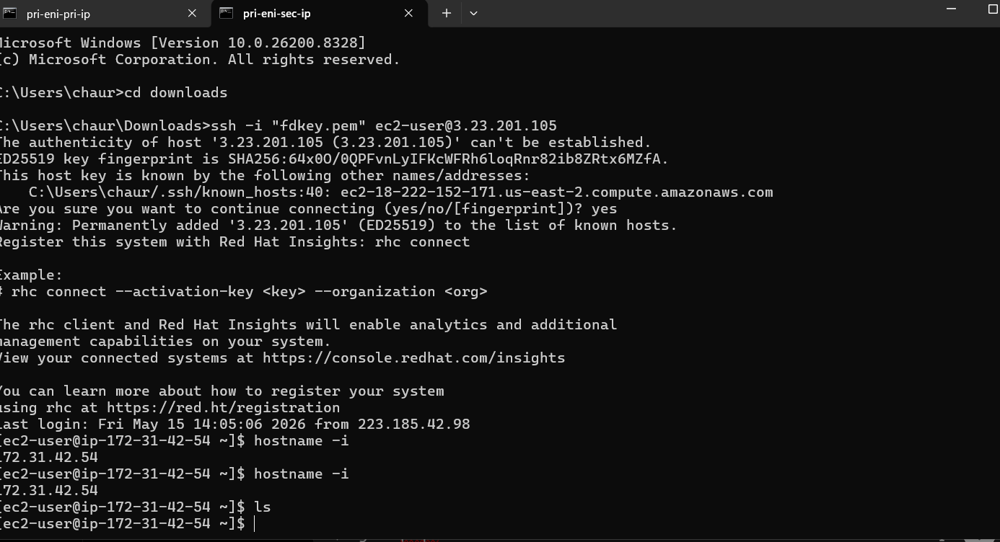

---

## Verify Network Interfaces

```bash
ip a
```

### Screenshot

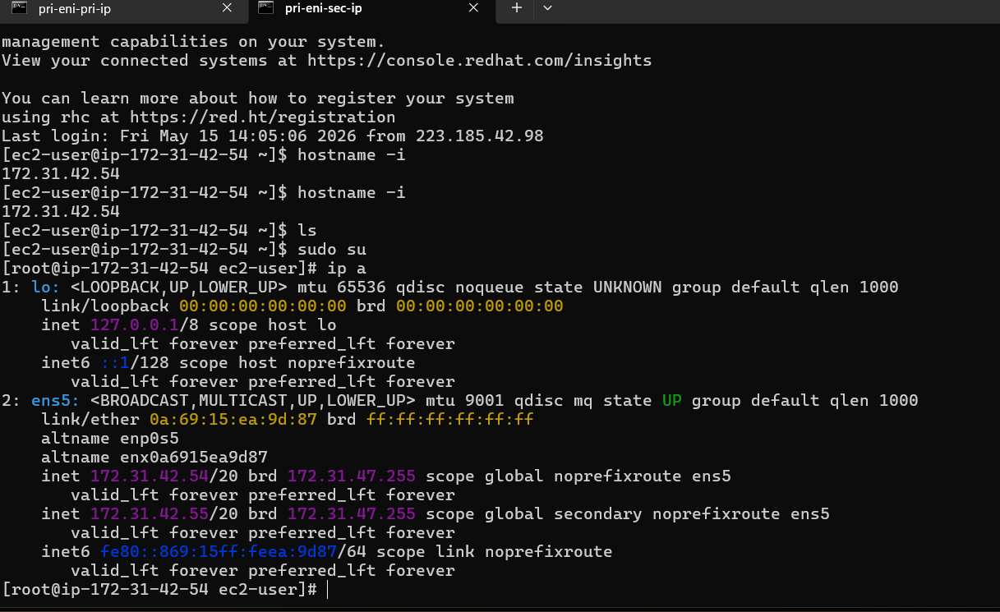

---

# 🌐 Apache HTTP Server Setup

## Install Apache

```bash
sudo yum install httpd -y
```

### Screenshot

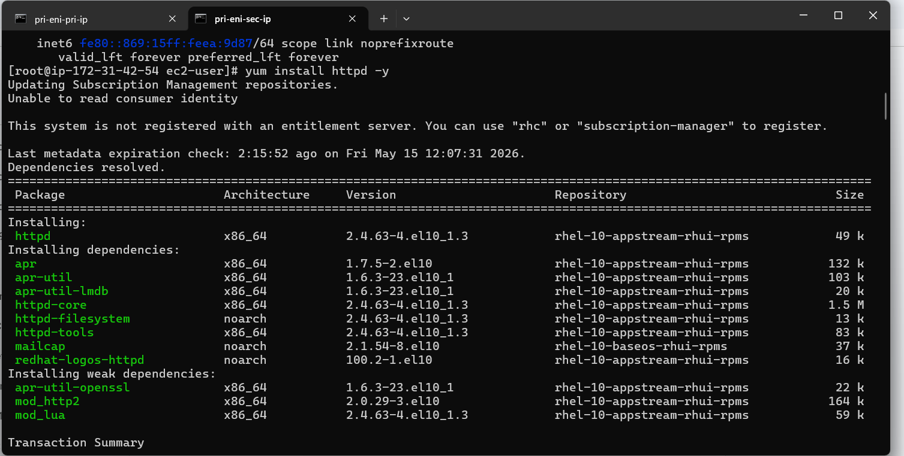

---

## Validate Apache Service

```bash
curl localhost
```

### Screenshot

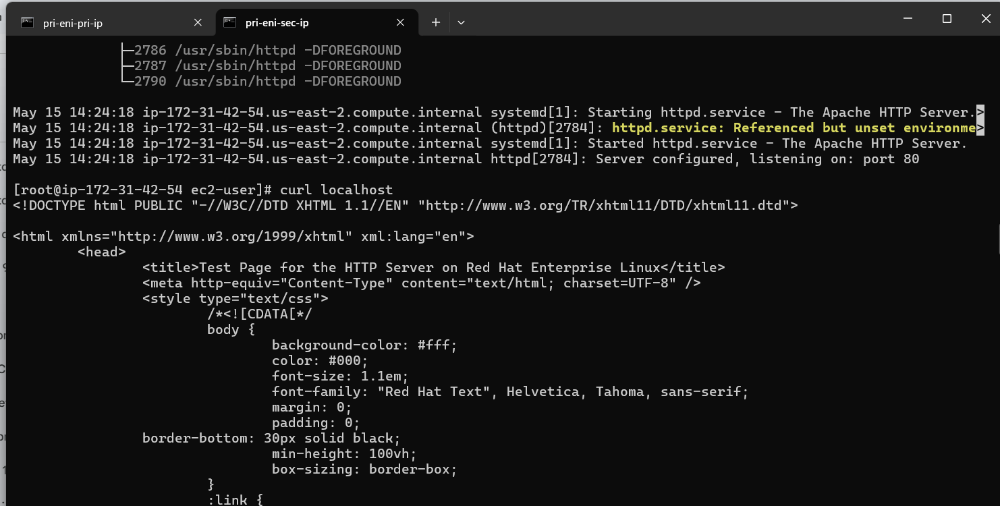

---

# 🌍 Browser Output Validation

Successfully validated Apache web page using:
- Primary Public IP
- Primary Elastic IP
- Secondary ENI Elastic IP

---

## Primary Public IP

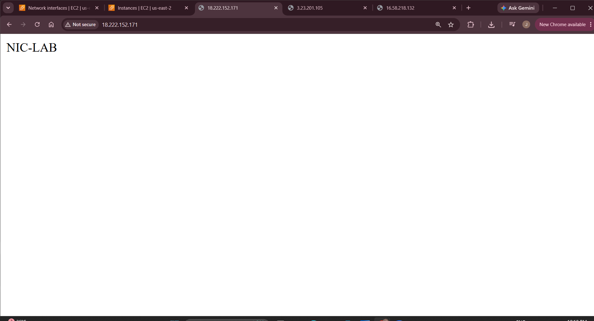

---

## Primary Elastic IP

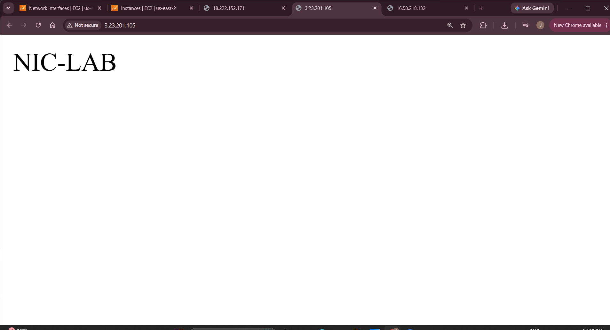

---

## Secondary ENI Elastic IP

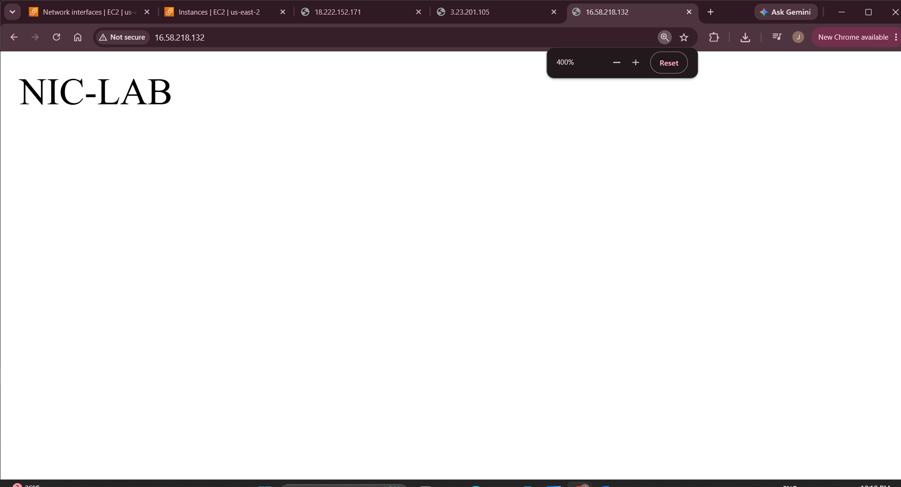

---

# 📚 Learning Outcomes

Through this project, I learned:

- AWS EC2 networking
- Elastic Network Interfaces (ENI)
- Elastic IP configuration
- Apache HTTP Server deployment
- Linux networking commands
- Security Group configuration
- ENI persistence behavior
- Infrastructure documentation
- GitHub project structuring

---

# 🧪 Commands Used

## Linux Networking

```bash
ip a
hostname -i
ip route
ping google.com
```

## Apache Commands

```bash
sudo yum install httpd -y
sudo systemctl start httpd
sudo systemctl enable httpd
curl localhost
```

---

# 📖 Documentation Files

| File | Description |
|------|-------------|
| project-flow.md | Complete implementation workflow |
| eni-concepts.md | AWS ENI concepts |
| troubleshooting.md | Common issues and fixes |
| networking-basics.md | Networking fundamentals |
| apache-commands.md | Apache administration commands |
| eni-commands.md | ENI & networking commands |

---

# ✅ Project Status

```text
Project Completed Successfully
```

---

# 👩‍💻 Author

## Jaishree Chaure

AWS | Linux | Networking | DevOps Learner

---